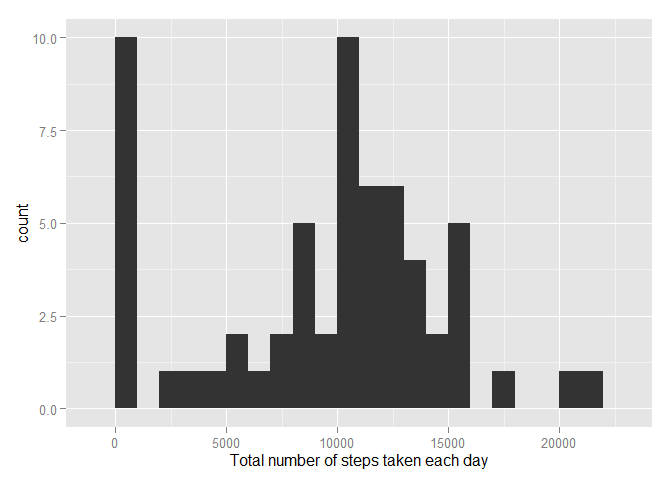
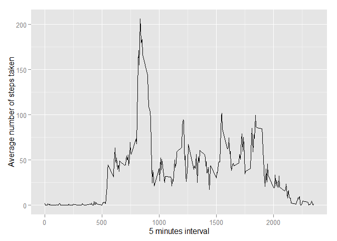
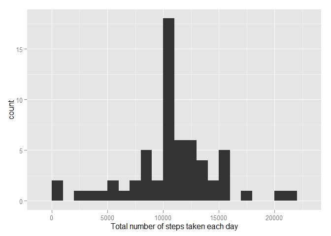

# Reproducible Research: Peer Assessment 1


Use ggplot

```r
#use ggplot
library(ggplot2)
```


## Loading and preprocessing the data


```r
RRdata<-read.csv("activity.csv")
```


## What is mean total number of steps taken per day?


```r
total.steps <- tapply(RRdata$steps, RRdata$date, FUN = sum, na.rm = TRUE)
qplot(total.steps, binwidth = 1000, xlab = "Total number of steps taken each day")
```

 


```r
mean(total.steps, na.rm = TRUE)
```

```
## [1] 9354.23
```

```r
median(total.steps, na.rm = TRUE)
```

```
## [1] 10395
```


## What is the average daily activity pattern?


```r
averages <- aggregate(x = list(steps = RRdata$steps), by = list(interval = RRdata$interval), 
    FUN = mean, na.rm = TRUE)
ggplot(data = averages, aes(x = interval, y = steps)) + geom_line() + xlab("5 minutes interval") + 
    ylab("Average number of steps taken")
```

 
   

```r
averages[which.max(averages$steps),]
```

```
##     interval    steps
## 104      835 206.1698
```


## Imputing missing values
To handle with missing values labels as NA.


```r
missingV <- is.na(RRdata$steps)
# How many NA's
table(missingV)
```

```
## missingV
## FALSE  TRUE 
## 15264  2304
```

Which later the missing values are replaced with the mean value for 5 minutes interval

```r
# Replace each missing value with the mean value of its 5 minutes interval
fill.value <- function(steps, interval) {
    filled <- NA
    if (!is.na(steps)) 
        filled <- c(steps) else filled <- (averages[averages$interval == interval, "steps"])
    return(filled)
}
filled.data <- RRdata
filled.data$steps <- mapply(fill.value, filled.data$steps, filled.data$interval)
```

Using the replaced values for NA, the histogram of the total number of steps taken each day and the mean and median total number of steps are calculated.


```r
total.steps <- tapply(filled.data$steps, filled.data$date, FUN = sum)
qplot(total.steps, binwidth = 1000, xlab = "Total number of steps taken each day")
```

 


```r
mean(total.steps)
```

```
## [1] 10766.19
```

```r
median(total.steps)
```

```
## [1] 10766.19
```

Do these values differ from the estimates from the first part of the assignment? What is the impact of imputing missing data on the estimates of the total daily number of steps?

Mean and median values are definitely higher after imputing missing data (replacing the NAs). Reason being, there are some days with steps values NA for any interval. The total number of steps taken in such days are set to 0s by default. By replacing missing steps values with the mean steps of associated interval value, these 0 values are removed from the histogram of total number of steps taken each day.


## Are there differences in activity patterns between weekdays and weekends?

For this question, we use the dataset with the filled-in values.


```r
weekday.or.weekend <- function(date) {
    day <- weekdays(date)
    if (day %in% c("Monday", "Tuesday", "Wednesday", "Thursday", "Friday")) 
        return("weekday") else if (day %in% c("Saturday", "Sunday")) 
        return("weekend") else stop("invalid date")
}
filled.data$date <- as.Date(filled.data$date)
filled.data$day <- sapply(filled.data$date, FUN = weekday.or.weekend)
```

Panel plot containing plots of average number of steps taken on weekdays and weekends.


```r
averages <- aggregate(steps ~ interval + day, data = filled.data, mean)
ggplot(averages, aes(interval, steps)) + geom_line(color="firebrick") + facet_grid(day ~ .) + 
    xlab("5 minutes interval") + ylab("Number of steps") +geom_point(color="firebrick")+
  theme(panel.background = element_rect(fill = 'grey75'))
```

 
